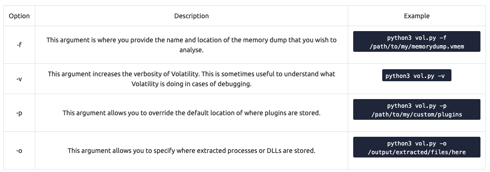

# Day 4

### What is the name of the HTTP server running on the remote host?

```bash
nmap -sV 10.10.103.165
```

<figure><figcaption></figcaption></figure>


Apache


### What is the name of the service running on port 22 on the QA server?

<figure><figcaption></figcaption></figure>


SSH


### What flag can you find after successfully accessing the Samba service?

<figure><figcaption></figcaption></figure>

* Username: ubuntu
* Password: S@nta2022


{THM\_SANTA\_SMB\_SERVER}


### What is the password for the username santahr?

<figure><figcaption></figcaption></figure>


santa25

